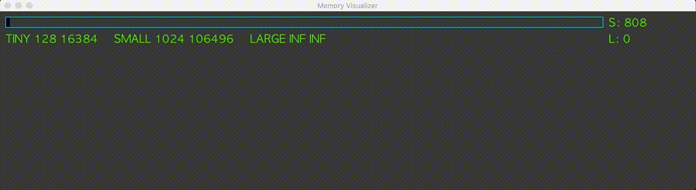
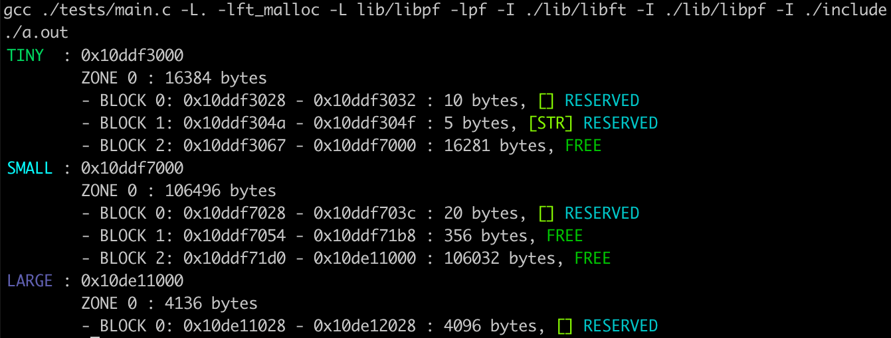
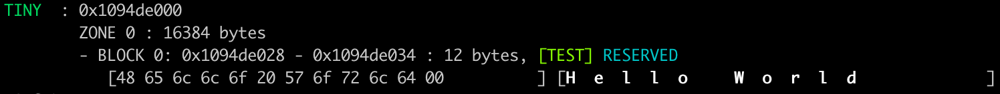

##	My dynamic memory allocation & management library in c.

My Malloc, Realloc and Free can be used in programs already in use without modifying them or recompiling.
The project was writen in following the Norm. See TheNorm.md in the root of the repositorty.

#### Summary

* [Installation](#installation)
* [Theory](#theory)
* [Notable Features](#notable-features)
* [Recreated Functions](#recreated-functions)
* [Custom Functions](#custom-functions)
* [Visualizer Functions](#visualizer-functions)



#### Installation

```sh
git clone https://github.com/Epicurius/Dynamic-memory-library.git libmalloc
cd libmalloc

# to create a standard
make -f Makefile

# to create with visualizer
make -f Makefile-visualizer

# For small projects, only for malloc, realloc and free:
./run.sh <EXECUTABLE>

# For all features:
# Link like a normal library and run once
export DYLD_LIBRARY_PATH= < PATH TO libmalloc/ >

```
---

#### Theory
For each allocation the program has to save some info about the allocation, and it does it in a struct called s_block.
```c
typedef struct s_block
{
	struct s_block	*next;
	int		free;
	char		str[4];
	size_t		size;
}			t_block;
```
|Variabel				|Explanation												|Bytes	|
|---					|---														|:---:	|
|struct s_block *next	|Pointer to the next block, NULL if is the last one.		|	8	|
|int free				|TRUE or FALSE is the block is not in use.					|4		|
|char str[4]			|Struct padding, but is utilized by ft_malloc to save hash.	|1 * 4	|
|size_t size			|Size of the memory stored.									|8		|

So everytime an allocation is called the total size is __requsted size + sizeof(t_block)__.
Now for example we call __malloc(5) 100 times__.
For each call the program has to reserve memory space, this is slow and waisfull.
To solve this the program sorts each allocation call into 3 types (TINY, SMALL, LARGE) depeding on requested size.

|Type			|	Min Bytes	|	Max Bytes	|	Zone Size	|
|:--------------|:-------------:|:-------------:|:-------------:|
|	TINY		|	0			|		128		|	16384		|
|	SMALL		|	129			|		1024	|	106496		|
|	LARGE		|	1025		|		INF		|	Exact amount|

For TINY and SMALL the program allocates a predetermined size called Zone.
```c
typedef struct s_zone
{
	struct s_zone	*next;
	void			*end;
}					t_zone;
```
|Variabel				|Explanation												|Bytes	|
|---					|---														|:---:	|
|struct s_zone *next	|Pointer to the next zone, NULL if is the last one.			|	8	|
|void *end				|Pointer to the the end of the zone.						|	8	|

The Zone size is the lowest possible amount of __getpagesize()__ that can fit __((type max + 24) * 100) + sizeof(t_zone)__.
-	TINY : **(128 + 24) * 100 + 16 = 15216** is less than **4096 * 4 = 16384**
-	SMALL : **(1024 + 24) * 100 + 16 = 105616** is less than **4096 * 26 = 106496**

So if malloc(5) is called 100 times, the first call will allocate 16384 Bytes, but use only __5 + sizeof(t_block) + sizeof(t_zone)__.
And for the next 99 times it does not need to reserve memory space, it can utilize the remaining space left over in Zone.
Each subsequent malloc call will only use __5 + sizeof(t_block)__.
When a zone is filled up the next malloc call will create a new zone and repeat the proccess.
This makes small allocation a lot faster and more memory efficient.
While LARGE allocation allways need to reserve new memory space, and take up __requested size + sizeof(t_block) + sizeof(t_zone)__.

---
#### Notable Features

-	When type SMALL or LARGE memory is freed the only thing that happen is the t_block->free is set to TRUE.
	The memory is not erased it is just marked for re use.
-	The library will try to “Defragment” freed memory. Meaning if the next or previous block is also
	free it will merge them into 1 free block.
-	The Library includes a visualizer. It only runs on OSX and will intall SDL2 Frameworks into ~/Library/Frameworks/.
	See 'Visualizer functions' section for more info.
-	Library is “Thread safe”, it should not cause issues if used with pthread.
-	show_alloc_mem_ex(int flags) is usefull debugging tool. See 'Personal help functions' section for more info.
-	ft_malloc(size_t *size, char *hash) same as normall malloc but takes in a 4 char hash and saves it in t_block->str.
	The 4 bytes where going to waste so I use them with ft_malloc() to mark individual memory blocks.
	The hash can be viewed with	show_alloc_mem_ex(MEM_SHOW_HASH)
-	ft_memfind(char *hash) returns a pointer to the memory with same hash. Note: Use ft_malloc().
-	ft_mempurge(void) frees all the memory allocted by malloc, realloc, calloc, ft_malloc.
	Without the developer having to free every indiviual memory block themselves.
---
####	Recreated Functions
	void	*malloc(size_t size)
		- Allocates size_t size amount of memory.
	void	*calloc(size_t num, size_t size)
		- Allocates size_t size amount of memory ans sets num amount to null.
	void	*realloc(void *ptr, size_t size)
		- Changes the memory pointed by ptr to size without loosing what it saved in it.
	void	free(void *ptr)
		- Frees the memory pointed to by *ptr.
---
####	Custom Functions
	void	*ft_malloc(size_t size, char *code)
		- Allocates size_t size amount of memory and saves code for debugging.
	void	*ft_memfind(char *hash)
		- Find pointer to memory with hash.
	void	ft_mempurge(void)
		- Delets all memory that was allocated.
	void	show_alloc_mem_ex(int flags)
		- Print usefull info to stdout.
		-----------------------------------------------------------------------
		MEM_SHOW_TINY		=	Print all TINY memory allocations.	
		MEM_SHOW_SMALL		=	Print all SMALL memory allocations.
		MEM_SHOW_LARGE		=	Print all LARGE memory allocations.
		MEM_HEXDUMP		=	Print all memory hex positions.	
		MEM_SHOW_FREE		=	Print all memory slots that are free.
		MEM_SHOW_HASH		=	Print all hash. (Use ft_malloc)	
		MEM_WRITE		=	Write all output to file.			
		-----------------------------------------------------------------------

### Test1
```c
#inlude "libmem.h"

void	main(void)
{
	char *str[5];

	str[0] = malloc(10);
	str[1] = malloc(400);
	str[2] = realloc(str[2], 20);
	str[3] = ft_malloc(5, "STR");
	str[4] = malloc(2048);
	free(str[4]);
	str[4] = malloc(4096);
	show_alloc_mem_ex(MEM_SHOW_HASH | MEM_SHOW_FREE);
	ft_mempurge();
}
```


### Test2
```c
#inlude <stdio.h>
#inlude <string.h>
#inlude "libmem.h"

void	main(void)
{
	char *str;

	str = ft_malloc(sizeof(char) * 12, "TEST");
	strcpy(str, "Hello World");
	show_alloc_mem_ex(MEM_SHOW_TINY | MEM_SHOW_HASH | MEM_HEXDUMP);
	ft_mempurge();
}
```



---
####	Visualizer Functions
	void	init_memory_visualizer(void);
		- Init visualizer, has to be called once at program start.
	void	update_memory_visualizer(void);
		- Each time is called redraws all the memomry.
	void	free_memory_visualizer(void);
		- Frees everything allocated by the visualizer.


---
